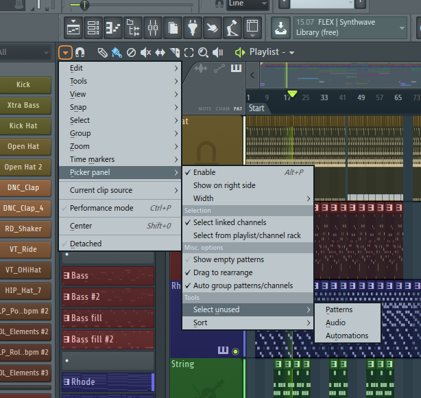
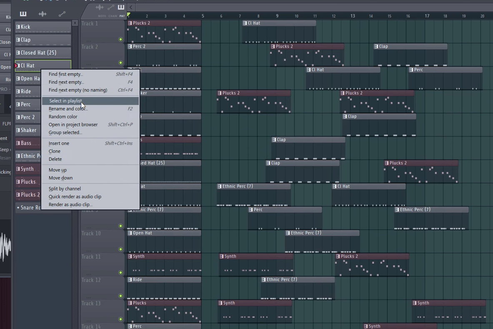
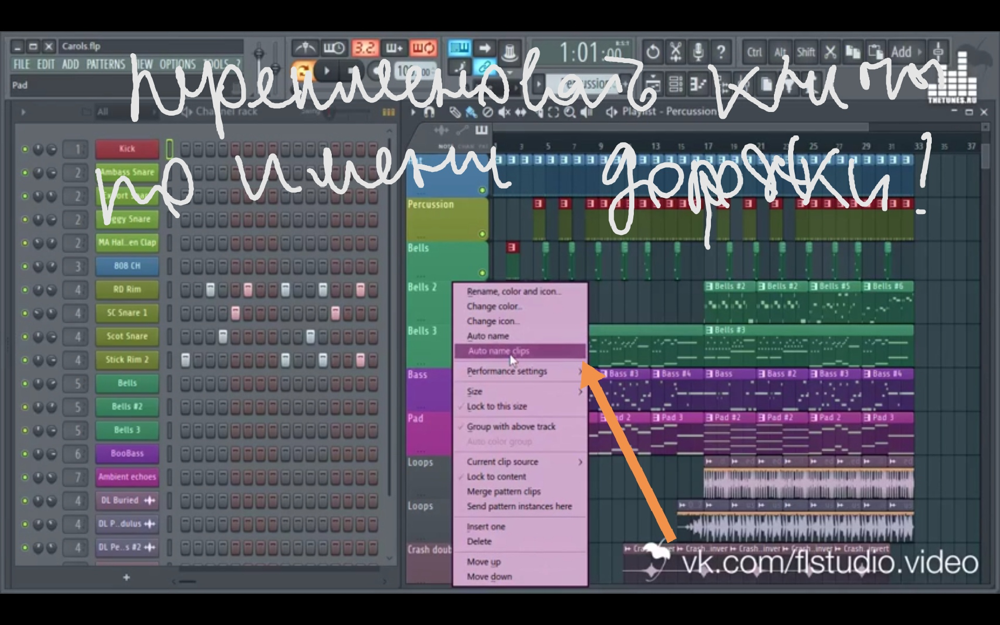

# Фишки FL Studio
<!-- copyright: ReSampled 3 -->

# Piano roll
   

Possible conflicts показывает сдвоенные ноты!! Select overlappng notes

right shift - split

alt-a - arpeggiator

alt-r randomize at piano roll

Piano roll / mixer / playlist - CTRL-SHIFT-CLICK позволяет выбрать отдельные элементы

Еще одним полезным помощником может стать функция Waveform View, отображающая звуковую волну на фоне нот в Piano Roll. Найти эту функцию можно перейдя в меню Options — Helpers — Background Waveform в окне опций Piano Roll

Piano roll / playlist - CTRL-B - копировать выделенный элемент и дублировать его справа

Piano roll SHIFT-D укорачиваети ноты до снэп-значения

playlist - right alt mute clip

Pianoroll - инструмент серые нотки

Piano roll - ALT-X - открывает скейлинг - можно рулить громкостью нот

Пианоролл нотки можно двигать с альтом без привязки к сетке (шифт - дублирует)

playlist - right alt mute clip

playlist - left alt move without snap

Alt + V
   

If it seems familiar to you, that is because I mentioned this shortcut key before in the previous article on how to stay in key while writing your melodies. This shortcut enables ghost channels in your piano roll. To fully know how this shortcut key works, click here to visit the previous article

   

   

-----------

# Channel rack
   

(Ниже опции для сдвига влево вправ)

Для перемещения дорожек в окне микшера достаточно кликнуть по дорожке, зажать клавишу Alt и при помощи стрелок влево или вправо переместить дорожку левее или правее в микшере. Для окна Channel Rack метод практически идентичен: клик по дорожке, зажатие Alt и использование стрелок вверх или вниз.

CTRL-SHIFT-L - в ченнел рек выбираем несколько каналов, нажимаем и они роутятся каждый на свой канал микшера

   

   

-----------
         # Playlist

Track mode - instrument track

Piano roll / playlist - CTRL-B - копировать выделенный элемент и дублировать его справа

playlist - right alt mute clip

right shift - split

Piano roll / mixer / playlist - CTRL-SHIFT-CLICK позволяет выбрать отдельные элементы

   

   
   

Находясь в окне редактора плейлистов (Playlist Editor), самым простым методом увеличения или уменьшения области просмотра станет использование клавиш Page Up и Page Down, соответственно. В FL Studio существуют и другие шорткоды для зума, но использование Page Up/Page Down проще

   
   
   

-----------
         # Mixer

reset track to default - mixer

alt-l mixer (select channels routed to this track)

Mixer > dock to right For sends

Mixer > dock to left For main groups

*   <https://www.google.com/url?q=https://youtu.be/Qj4zT7Jxs9o&sa=D&ust=1605386470915000&usg=AOvVaw3JMXTZUugAPqjk0_DHJ_XL>      sends

* для каждой группы инструментов - шина

Piano roll / mixer / playlist - CTRL-SHIFT-CLICK позволяет выбрать отдельные элементы

* Для перемещения дорожек в окне микшера достаточно кликнуть по дорожке, зажать клавишу Alt и при помощи стрелок влево или вправо переместить дорожку левее или правее в микшере.

   

-----------
         # Опции

   

кнопка auto выставляет директорию

   

* Detach all plugins

   

   

-----------
         # Sampler

Если у тебя в проекте ты используешь длинные аудио сэмплы или дорожки в каналах Sampler, то убедись, что у них у всех активна вот эта опция Keep on disk (хранить на жестком диске):

   

-----------
         # Slisex
  <https://www.google.com/url?q=https://fl-studiopro.ru/obrabotka-vokala/126-kak-sozdavat-effektnye-vokalnye-narezki-v-fl-studio-s-slicex.html&sa=D&ust=1605386470918000&usg=AOvVaw2AGVcReYohXvfinYTIu9hG>      - slisex - можно копировать маркеры из одного в другой! ???????

-----

 ------

     # Transport
   

Options ~ step edit  

-----

     # Plugin picker

Plugin Picker. Открыть его можно кнопкой в виде "вилки" на быстрой панели fl studio, или самый простой способ - это щелкнув колесиком мыши по пустому рабочему столу студии.

-----------
         # fruity convolver

-----------
         # Wave Candy

   

-----------
         # Browser
   

(СРЕДНЯЯЯ!!)

   

   

Поиск патчей и пресетов через окно браузера. Для того, чтобы закрепить часто используемые папки для последующего использования, FL Studio предлагает воспользоваться снэпшотами. Пользователю доступно 9 снэпшотов. Выберите снэпшот, в который хотите «запомнить». Перейдите в браузер, найдите желаемую папку и разверните ее содержимое. Снэпшот сохранен. Для создания новой закладки достаточно выбрать следующий свободный снэпшот и повторить действия по выбору папки. Каждый снэпшот можно «заморозить», чтобы не подвергать его каким-либо изменениям.

   

* Браузер можно свернуть налево и открывать даблкликом

-----------

     # Меню VIEW
   

   

* View > project picker

-----------
         # Меню ADD

   

-----

 ------

     # Mеню OPTIONS

ctrl-t отключить клаву отwrapper

-----

 ------

     # Fruity Envelope Controller

-----
 ------

     # Меню TOOLS

   

Представьте, что вы наиграли какую-то мелодию при помощи своей MIDI-клавиатуры и забыли ее записать. Вместо того, чтобы пытаться вспомнить сыгранное, сделайте пустой паттерн, а затем выберите из меню Tools пункт ‘Dump Score Log to Selected Channels’. Программа восстановит в выбранную дорожку все, что было сыграно, но не записано.

----------

     # Patcher

-----

     # Сведение

  ударные должны немного не достигать этого пика, колеблясь в своей атаке (максимальной громкости конкретного звука) в пределах -4 дБ

  (или   --   В поп-дэнс музыке бас барабан (кик) выводят таким образом, чтобы он свободно колебался от -inf. до -6 Дб.  )

  (  <https://www.google.com/url?q=https://lumpics.ru/mixing-and-mastering-in-fl-studio/&sa=D&ust=1605386470924000&usg=AOvVaw2dKtZuyP3PrdexvnK1ZuYH>  )

  Партия бочки (kick) по большей части состоит с низко- и частично среднечастотного диапазона, поэтому с помощью одного из стандартных эквалайзеров ФЛ Студии, для большей эффективности, можно срезать у этого звука высокие частоты(свыше 5 000 Гц). Также, не лишним будет обрезать и глубокий низкочастотный диапазон (25-30 Гц), в котором kick попросту не звучит (это видно по цветовым колебаниям в окне эквалайзера).   что касается kick, как уже было сказано выше, у него необходимо обрезать высокий частотный диапазон и глубокий низкий (все, что ниже 25-30 Гц), в которых он и так не звучит. А вот в том месте, где он наиболее слышим (заметно по визуальной шкале эквалайзера), ему можно немного придать силы, слегка прибавив частот в этом (50 — 19 Гц) дипазоне.
   

  Snare или Clap, наоборот, по своей природе не имеет низких частот, но для большей эффективности и лучшего качества звука, этот самый НЧ-диапазон (все, что ниже 135 Гц) необходимо срезать. Чтобы придать звучанию резкости и акцента можно немного поработать со средними и высокими частотами этих инструментов в эквалайзере, оставив только самый «сочный» диапазон.
   

  Креш выставляется по уровню звука, так же как и кик или чуть ниже.
  Lead.    Атака lead должна быть равна по громкости атаке кика.

  В среднем на дБ метре уровень сигнала микса колеблется от -4 до -1 дБ. (ДО МАСТЕРА)

 ------

     # Мастеринг

   Среднеквадратичное значение уровня сигнала получается не меньше -12 dB;
 

  <https://www.google.com/url?q=https://fl-studiopro.ru/interesnoe/63-dlya-professionalnogo-svedeniya-vam-nuzhny-lish-eti-2-plagina.html&sa=D&ust=1605386470926000&usg=AOvVaw0jDiwPfYyAaEj2Tcwfp27J>

  <https://www.google.com/url?q=https://www.youtube.com/watch?v%3DtFTCU9R77gk&sa=D&ust=1605386470926000&usg=AOvVaw0ebmkG1CCysmOjPdgKt-6f>

  <https://www.google.com/url?q=https://samesound.ru/g/soft/76609-10-cool-fl-studio-features&sa=D&ust=1605386470927000&usg=AOvVaw1lAytO5q3OymI18TbsVLi8>
  <https://www.google.com/url?q=https://bigsong.ru/kurs-fl-studio/svedenie-trekov/cvedenie-i-mastering-v-fl-studio.html&sa=D&ust=1605386470927000&usg=AOvVaw3DVuAVt5eFGeNt0_1nFYkv>

 ------

